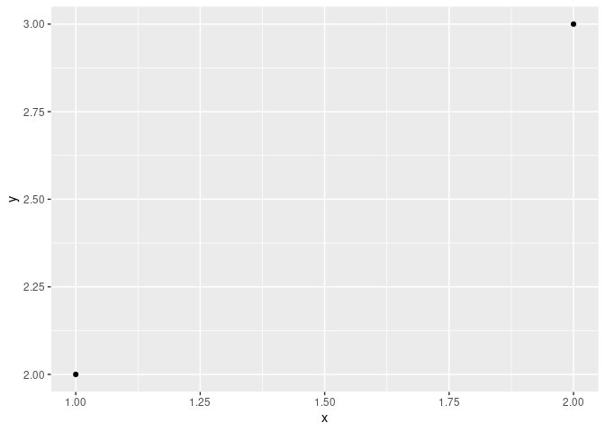
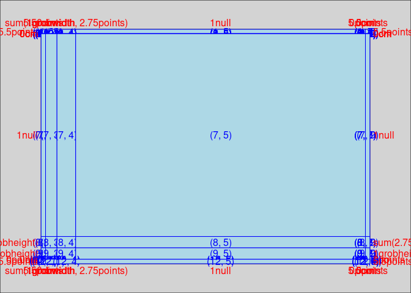
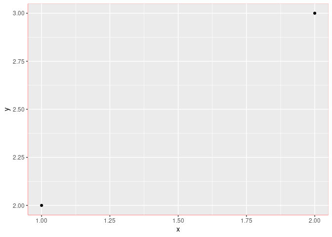
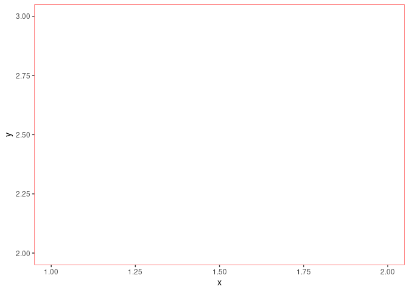
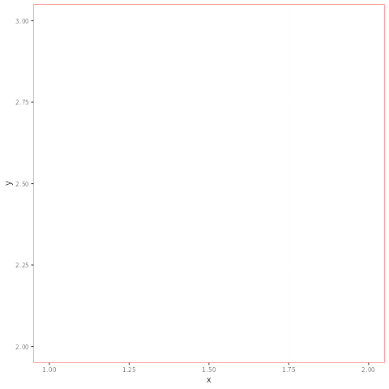

<!-- README.md is generated from README.Rmd. Please edit that file -->

# A Desparate Attempt to Understand {gtable} and {grid}

<!-- badges: start -->
<!-- badges: end -->

## References

-   [(Unofficial) overview of
    gtable](https://cran.r-project.org/web/packages/gridExtra/vignettes/gtable.html)
-   [gtable](https://gtable.r-lib.org/)
-   [Getting to Know grid Graphics by Paul Murrell
    (UseR! 2015)](https://www.stat.auckland.ac.nz/~paul/useR2015-grid/grid-slides.html)

## gtable

`ggplot` object can be plotted.

``` r
library(ggplot2)

d <- data.frame(x = 1:2, y = 2:3)
p <- ggplot(d, aes(x, y)) +
  geom_point()

p
```

<!-- -->

`ggplot` object can be converted into a `gtable` by `ggplotGrob()`.

``` r
gt <- ggplotGrob(p)

class(gt)
#> [1] "gtable" "gTree"  "grob"   "gDesc"
```

A `gtable` can be plotted by `grid.draw()` (or `plot()`)

``` r
library(grid)

grid.draw(gt)
```

<!-- -->

This is done by `grid.draw.gTree()` provided by grid package; there’s no
such method as `grid.draw.gtable()`. That is, a `gtable` object is just
a `gTree`.

``` r
sloop::s3_dispatch(grid.draw(gt))
#>    grid.draw.gtable
#> => grid.draw.gTree
#>  * grid.draw.grob
#>    grid.draw.gDesc
#>    grid.draw.default
```

If we `print()` a `gtable` object instead of `plot()`ing, we can get the
table of the content.

``` r
print(gt)
#> TableGrob (12 x 9) "layout": 18 grobs
#>     z         cells       name                                         grob
#> 1   0 ( 1-12, 1- 9) background               rect[plot.background..rect.76]
#> 2   5 ( 6- 6, 4- 4)     spacer                               zeroGrob[NULL]
#> 3   7 ( 7- 7, 4- 4)     axis-l           absoluteGrob[GRID.absoluteGrob.64]
#> 4   3 ( 8- 8, 4- 4)     spacer                               zeroGrob[NULL]
#> 5   6 ( 6- 6, 5- 5)     axis-t                               zeroGrob[NULL]
#> 6   1 ( 7- 7, 5- 5)      panel                      gTree[panel-1.gTree.56]
#> 7   9 ( 8- 8, 5- 5)     axis-b           absoluteGrob[GRID.absoluteGrob.60]
#> 8   4 ( 6- 6, 6- 6)     spacer                               zeroGrob[NULL]
#> 9   8 ( 7- 7, 6- 6)     axis-r                               zeroGrob[NULL]
#> 10  2 ( 8- 8, 6- 6)     spacer                               zeroGrob[NULL]
#> 11 10 ( 5- 5, 5- 5)     xlab-t                               zeroGrob[NULL]
#> 12 11 ( 9- 9, 5- 5)     xlab-b titleGrob[axis.title.x.bottom..titleGrob.67]
#> 13 12 ( 7- 7, 3- 3)     ylab-l   titleGrob[axis.title.y.left..titleGrob.70]
#> 14 13 ( 7- 7, 7- 7)     ylab-r                               zeroGrob[NULL]
#> 15 14 ( 4- 4, 5- 5)   subtitle         zeroGrob[plot.subtitle..zeroGrob.72]
#> 16 15 ( 3- 3, 5- 5)      title            zeroGrob[plot.title..zeroGrob.71]
#> 17 16 (10-10, 5- 5)    caption          zeroGrob[plot.caption..zeroGrob.74]
#> 18 17 ( 2- 2, 2- 2)        tag              zeroGrob[plot.tag..zeroGrob.73]
```

`gtable_show_layout()` visualizes the layout.

``` r
gtable::gtable_show_layout(gt, newpage = FALSE)
```

<!-- -->

As its document says, `gtable_show_layout()` is

> a simple wrapper around `grid::grid.show.layout()` that allows you to
> inspect the layout of the gtable.

It calls `grid.layout()` with the size information of each components.

``` r
gtable::gtable_show_layout
#> function (x, ...) 
#> {
#>     if (!is.gtable(x)) 
#>         stop("x must be a gtable", call. = FALSE)
#>     grid.show.layout(gtable_layout(x), ...)
#> }
#> <bytecode: 0x55f59d87baa0>
#> <environment: namespace:gtable>
gtable:::gtable_layout
#> function (x) 
#> {
#>     if (!is.gtable(x)) 
#>         stop("x must be a gtable", call. = FALSE)
#>     grid.layout(nrow = length(x$heights), heights = x$heights, 
#>         ncol = length(x$widths), widths = x$widths, respect = x$respect)
#> }
#> <bytecode: 0x55f5a2455cb0>
#> <environment: namespace:gtable>
```

### Get a component from gtable

[As `gtable_filter()`
does](https://github.com/r-lib/gtable/blob/0fc53e08f81eb5c9c18ebfbb832ff979c5eb9f01/R/filter.r#L37),
we can specify the index of a component by `<gtable>$layout` and subset
`<gtable>$grobs` by that index.

``` r
# This is a data.frame
gt$layout
#>     t l  b r  z clip       name
#> 18  1 1 12 9  0   on background
#> 1   6 4  6 4  5  off     spacer
#> 2   7 4  7 4  7  off     axis-l
#> 3   8 4  8 4  3  off     spacer
#> 4   6 5  6 5  6  off     axis-t
#> 5   7 5  7 5  1   on      panel
#> 6   8 5  8 5  9  off     axis-b
#> 7   6 6  6 6  4  off     spacer
#> 8   7 6  7 6  8  off     axis-r
#> 9   8 6  8 6  2  off     spacer
#> 10  5 5  5 5 10  off     xlab-t
#> 11  9 5  9 5 11  off     xlab-b
#> 12  7 3  7 3 12  off     ylab-l
#> 13  7 7  7 7 13  off     ylab-r
#> 14  4 5  4 5 14  off   subtitle
#> 15  3 5  3 5 15  off      title
#> 16 10 5 10 5 16  off    caption
#> 17  2 2  2 2 17  off        tag
idx <- which(gt$layout$name == "panel")

stopifnot(length(idx) == 1L)

g_panel <- gt$grobs[[idx]]

g_panel
#> gTree[panel-1.gTree.56]
```

### Modify a component

Now that we grasped the panel’s grob, let’s replace it with an empty
grob and draw it.

``` r
rect <- rectGrob(gp = gpar(col = "red"))
e <- new.env(parent = emptyenv())

# show the viewport
class(rect) <- c("spyRect", class(rect))
makeContent.spyRect <- function(x) {
  vp <- current.viewport()
  e$vp <- vp$name
  
  message("I'm here! ", vp$name)
  
  # Remove spyRect class
  class(x) <- class(x)[-1]
  grid::makeContent(x)
}

registerS3method("makeContent", "spyRect", makeContent.spyRect)

gt$grobs[[idx]] <- rect

grid.draw(gt)
#> I'm here! panel.7-5-7-5
#> I'm here! panel.7-5-7-5
```

<!-- -->

Then, move to that viewport (to return to the top viewport, use
`upViewport(0)`).

``` r
# This isn't needed on the interactive session.
grid.draw(gt)
#> I'm here! panel.7-5-7-5
#> I'm here! panel.7-5-7-5
downViewport(e$vp)
```

We can confirm our location by the following function.

``` r
# pak::pkg_install("yutannihilation/gridutils")
library(gridutils)

gu_you_are_here()
```

Then, plot the grob to get the same plot.

``` r
# This isn't needed on the interactive session.
grid.draw(gt)
#> I'm here! panel.7-5-7-5
#> I'm here! panel.7-5-7-5
downViewport(e$vp)

grid.draw(g_panel)
```

<!-- -->

Why did I do such a thing? Well, this way we can modify the grob
directly.

For example, tweak the x and y directly.

``` r
# helper
cpp11::cpp_source(
  code = '
#include <cpp11/R.hpp>
#include <R_ext/GraphicsEngine.h>

[[cpp11::register]] void
newpage() {
  pGEDevDesc dd = GEcurrentDevice();
  R_GE_gcontext gc;
  GENewPage(&gc, dd);
}
')
```

``` r
# This isn't needed on the interactive session.
grid.draw(gt)
#> I'm here! panel.7-5-7-5
#> I'm here! panel.7-5-7-5
downViewport(e$vp)
```

<!-- -->

``` r
# original values
g_panel$children[[3]][c("x", "y")]
#> $x
#> [1] 0.0454545454545455native 0.954545454545455native 
#> 
#> $y
#> [1] 0.0454545454545455native 0.954545454545455native
dev.copy(ragg::agg_png, filename = "tmp%03d.png")
#> I'm here! panel.7-5-7-5
#> I'm here! panel.7-5-7-5
#> agg_png 
#>       3
for (i in 1:10) {
  newpage()
  
  g_panel$children[[3]]$x <- unit(0.5 + (1 / 3:4) * sin(2 * pi * i / 20), units = "native")
  g_panel$children[[3]]$y <- unit(0.5 + (1 / 3:4) * cos(2 * pi * i / 20), units = "native")
  
  grid.draw(g_panel)
}

dev.off()
#> png 
#>   2
gifski::gifski(list.files(".", pattern = "tmp.*\\.png"), "ani.gif")
#> [1] "ani.gif"

```

<!-- -->

Or, plot only the panel to raster and add some fx on it?
